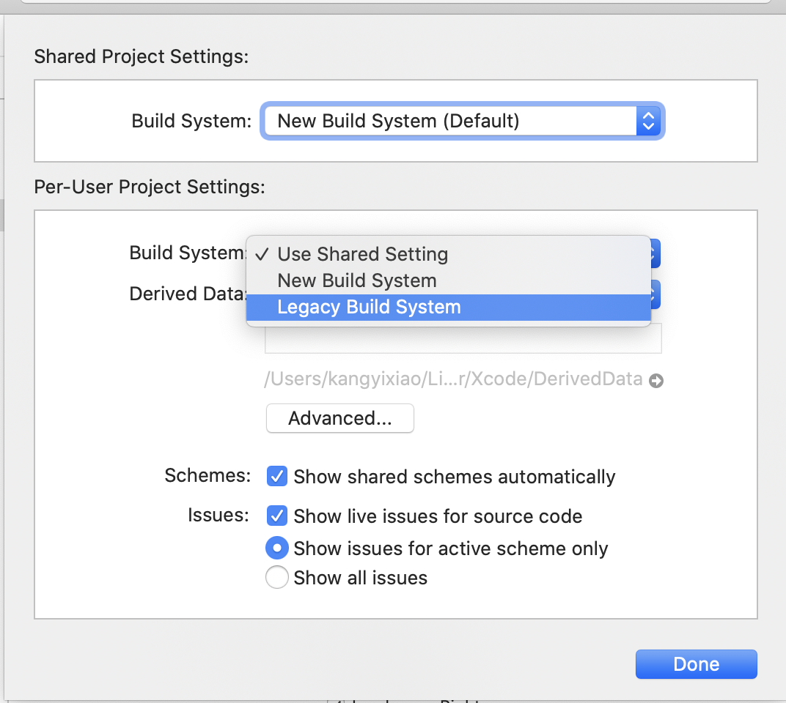
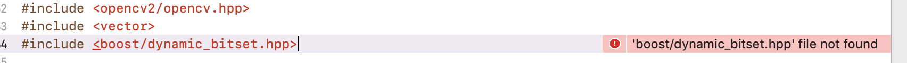
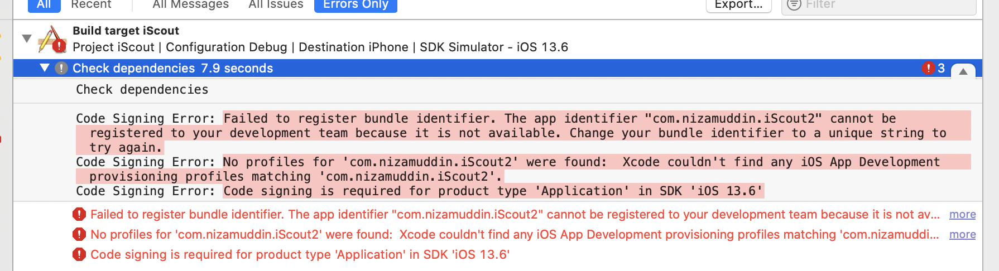
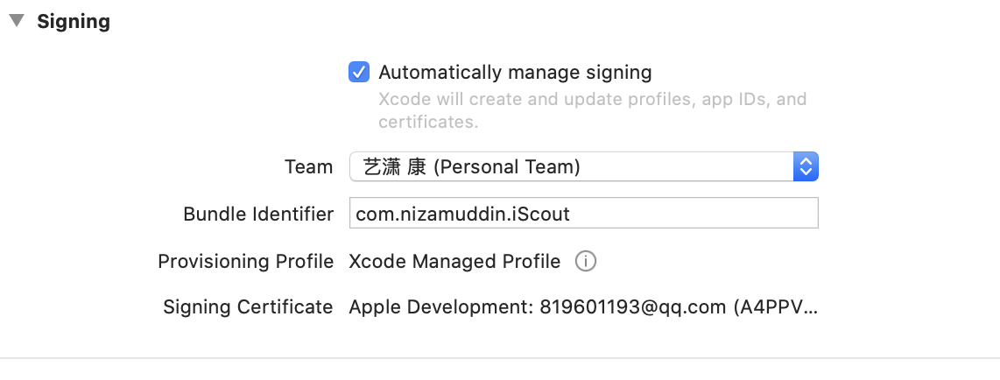
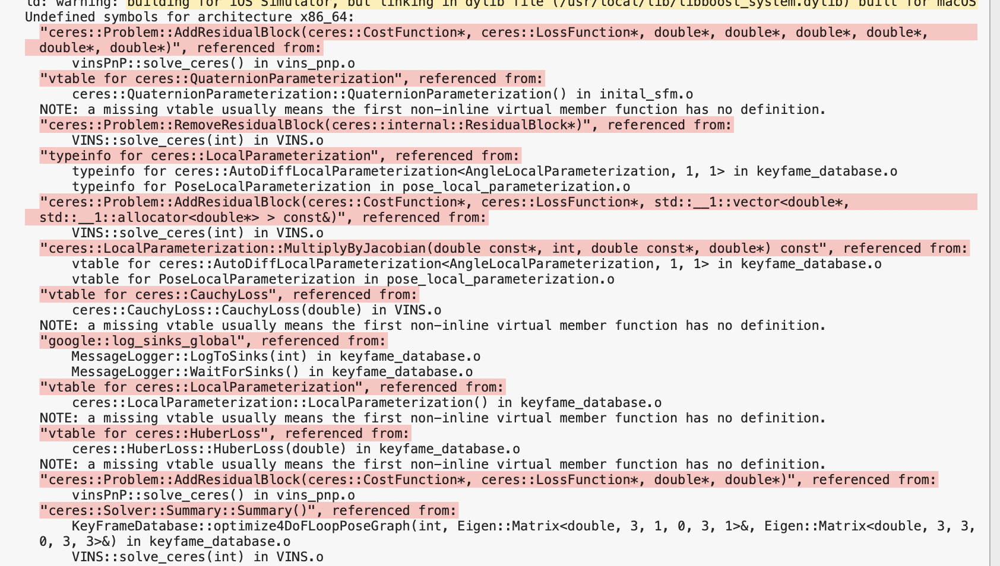
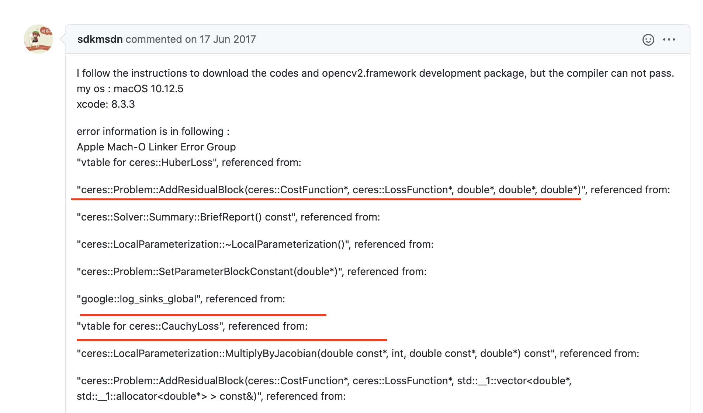

# 2020.8.28 iSout debug

## Bug1:模拟器适配 


Building for ios Simulator, but the linked library 'libceres.a' was built for iOS.
iScout.xcodepro

解决方案：file -->projectsettings-->building System -->改为Lagacy Building System





## Bug2:Boost 库未配置




'boost/dynamic_bitset.hpp' file not found

### 安装boost库

方法1：

```bash
brew install boost
```

```bash
Updating Homebrew...
==> Downloading https://mirrors.ustc.edu.cn/homebrew-bottles/bottles/icu4c-64.2.
######################################################################## 100.0%
==> Downloading https://mirrors.ustc.edu.cn/homebrew-bottles/bottles/boost-1.72.
######################################################################## 100.0%
==> Installing dependencies for boost: icu4c
==> Installing boost dependency: icu4c
==> Pouring icu4c-64.2.catalina.bottle.tar.gz
==> Caveats
icu4c is keg-only, which means it was not symlinked into /usr/local,
because macOS provides libicucore.dylib (but nothing else).

If you need to have icu4c first in your PATH run:
  echo 'export PATH="/usr/local/opt/icu4c/bin:$PATH"' >> ~/.zshrc
  echo 'export PATH="/usr/local/opt/icu4c/sbin:$PATH"' >> ~/.zshrc

For compilers to find icu4c you may need to set:
  export LDFLAGS="-L/usr/local/opt/icu4c/lib"
  export CPPFLAGS="-I/usr/local/opt/icu4c/include"

==> Summary
🍺  /usr/local/Cellar/icu4c/64.2: 257 files, 69.3MB
==> Installing boost
==> Pouring boost-1.72.0.catalina.bottle.tar.gz
🍺  /usr/local/Cellar/boost/1.72.0: 14,466 files, 648.6MB
==> Caveats
==> icu4c
icu4c is keg-only, which means it was not symlinked into /usr/local,
because macOS provides libicucore.dylib (but nothing else).

If you need to have icu4c first in your PATH run:
  echo 'export PATH="/usr/local/opt/icu4c/bin:$PATH"' >> ~/.zshrc
  echo 'export PATH="/usr/local/opt/icu4c/sbin:$PATH"' >> ~/.zshrc

For compilers to find icu4c you may need to set:
  export LDFLAGS="-L/usr/local/opt/icu4c/lib"
  export CPPFLAGS="-I/usr/local/opt/icu4c/include"
```

<u>/usr/local/Cellar/boost/1.72.0</u>   这个就是boost 的安装目录


方法2：似乎是这个成功了

接下来按照这个操作即可

> https://blog.csdn.net/waterbinbin/article/details/62438417?ops_request_misc=%257B%2522request%255Fid%2522%253A%2522159861983519724843339296%2522%252C%2522scm%2522%253A%252220140713.130102334..%2522%257D&request_id=159861983519724843339296&biz_id=0&utm_medium=distribute.pc_search_result.none-task-blog-2~all~first_rank_ecpm_v3~pc_rank_v2-1-62438417.first_rank_ecpm_v3_pc_rank_v2&utm_term=Xcode+配置boost&spm=1018.2118.3001.4187


1.配置头文件和链接库

点击项目->TARGETS->Build Settings->Search Pahts->Header Search Paths和Library Search Pahts

添加usr/local/include  以及/usr/local/lib


2.添加需要的libboost_filesystem.a和libboost_system.a文件才能运行成功

点击项目->TARGETS->Build Phases->Link Binary With Libraries

打开/usr/local/lib 找到相应的.a文件拖进去


结果


## Bug3：开发团队证书过期

Failed to register bundle identifier.





解决P1：

修改bundle Idetifier


变为————》


结果



参考：https://blog.csdn.net/liuzehn/article/details/84142253?ops_request_misc=%257B%2522request%255Fid%2522%253A%2522159866497519725222461316%2522%252C%2522scm%2522%253A%252220140713.130102334.pc%255Fall.%2522%257D&request_id=159866497519725222461316&biz_id=0&utm_medium=distribute.pc_search_result.none-task-blog-2~all~first_rank_ecpm_v3~pc_rank_v2-1-84142253.first_rank_ecpm_v3_pc_rank_v2&utm_term=The+app+identifier+%22com.nizamu&spm=1018.2118.3001.4187

原因讲解：

https://blog.csdn.net/qq_31337641/article/details/78401465?utm_medium=distribute.pc_relevant_t0.none-task-blog-BlogCommendFromMachineLearnPai2-1.channel_param&depth_1-utm_source=distribute.pc_relevant_t0.none-task-blog-BlogCommendFromMachineLearnPai2-1.channel_param

### Bug4:Linker command failed with exit code 1 (use -v to see invocation)文件重复


ld:5  duplicate symbols for architecture x86_64:  ======>>>>这行文字的意思在x86_64平台上编译的时候有5个重复的元素：

报错信息

```
Showing All Errors Only

Ld /Users/kangyixiao/Library/Developer/Xcode/DerivedData/iScout-dduqjqfqbpboowalwfvpspkqphih/Build/Products/Debug-iphoneos/iScout.app/iScout normal arm64

  cd /Users/kangyixiao/Desktop/PRP/iSout_develop/iScout的副本2_work_on/iScout

  export PATH="/Applications/Xcode.app/Contents/Developer/Platforms/iPhoneOS.platform/Developer/usr/bin:/Applications/Xcode.app/Contents/Developer/usr/bin:/usr/local/bin:/usr/bin:/bin:/usr/sbin:/sbin"

  /Applications/Xcode.app/Contents/Developer/Toolchains/XcodeDefault.xctoolchain/usr/bin/clang++ -Xlinker -rpath -Xlinker /usr/lib/swift -target arm64-apple-ios12.1 -isysroot /Applications/Xcode.app/Contents/Developer/Platforms/iPhoneOS.platform/Developer/SDKs/iPhoneOS13.6.sdk -L/Users/kangyixiao/Library/Developer/Xcode/DerivedData/iScout-dduqjqfqbpboowalwfvpspkqphih/Build/Products/Debug-iphoneos -L/Users/kangyixiao/Desktop/PRP/iSout_develop/iScout的副本2_work_on/iScout/VINS_ThirdPartyLib -L/Users/kangyixiao/Desktop/PRP/iSout_develop/iScout的副本2_work_on/iScout/Resources -L/Users/kangyixiao/Desktop/PRP/iSout_develop/iScout的副本2_work_on/iScout/VINS_ThirdPartyLib/ceres-solver/ceres-bin/lib -L/usr/local/lib -F/Users/kangyixiao/Library/Developer/Xcode/DerivedData/iScout-dduqjqfqbpboowalwfvpspkqphih/Build/Products/Debug-iphoneos -FVINS_ThirdPartyLib -FVINS_ThirdPartyLib/ceres-solver -FVINS_ThirdPartyLib/eigen3 -FVINS_ThirdPartyLib/ceres-solver/cmake -FVINS_ThirdPartyLib/ceres-solver/config -FVINS_ThirdPartyLib/ceres-solver/include -FVINS_ThirdPartyLib/ceres-solver/internal -FVINS_ThirdPartyLib/ceres-solver/ceres-bin -FVINS_ThirdPartyLib/ceres-solver/docs -FVINS_ThirdPartyLib/ceres-solver/examples -FVINS_ThirdPartyLib/ceres-solver/scripts -FVINS_ThirdPartyLib/ceres-solver/jni -FVINS_ThirdPartyLib/ceres-solver/data -FVINS_ThirdPartyLib/eigen3/unsupported -FVINS_ThirdPartyLib/eigen3/Eigen -FVINS_ThirdPartyLib/ceres-solver/config/ceres -FVINS_ThirdPartyLib/ceres-solver/include/ceres -FVINS_ThirdPartyLib/ceres-solver/internal/ceres -FVINS_ThirdPartyLib/ceres-solver/ceres-bin/lib -FVINS_ThirdPartyLib/ceres-solver/docs/source -FVINS_ThirdPartyLib/ceres-solver/examples/slam -FVINS_ThirdPartyLib/ceres-solver/examples/sampled_function -FVINS_ThirdPartyLib/ceres-solver/jni/config -FVINS_ThirdPartyLib/ceres-solver/data/libmv-ba-problems -FVINS_ThirdPartyLib/ceres-solver/data/nist -FVINS_ThirdPartyLib/eigen3/unsupported/Eigen -FVINS_ThirdPartyLib/eigen3/Eigen/src -FVINS_ThirdPartyLib/ceres-solver/config/ceres/internal -FVINS_ThirdPartyLib/ceres-solver/include/ceres/internal -FVINS_ThirdPartyLib/ceres-solver/internal/ceres/generated -FVINS_ThirdPartyLib/ceres-solver/internal/ceres/gtest -FVINS_ThirdPartyLib/ceres-solver/internal/ceres/miniglog -FVINS_ThirdPartyLib/ceres-solver/internal/ceres/gmock -FVINS_ThirdPartyLib/ceres-solver/docs/source/_templates -FVINS_ThirdPartyLib/ceres-solver/examples/slam/pose_graph_3d -FVINS_ThirdPartyLib/ceres-solver/examples/slam/pose_graph_2d -FVINS_ThirdPartyLib/ceres-solver/examples/slam/common -FVINS_ThirdPartyLib/ceres-solver/jni/config/ceres -FVINS_ThirdPartyLib/eigen3/unsupported/Eigen/CXX11 -FVINS_ThirdPartyLib/eigen3/unsupported/Eigen/src -FVINS_ThirdPartyLib/eigen3/Eigen/src/CholmodSupport -FVINS_ThirdPartyLib/eigen3/Eigen/src/misc -FVINS_ThirdPartyLib/eigen3/Eigen/src/Core -FVINS_ThirdPartyLib/eigen3/Eigen/src/SparseLU -FVINS_ThirdPartyLib/eigen3/Eigen/src/OrderingMethods -FVINS_ThirdPartyLib/eigen3/Eigen/src/plugins -FVINS_ThirdPartyLib/eigen3/Eigen/src/Householder -FVINS_ThirdPartyLib/eigen3/Eigen/src/PardisoSupport -FVINS_ThirdPartyLib/eigen3/Eigen/src/SparseCore -FVINS_ThirdPartyLib/eigen3/Eigen/src/Jacobi -FVINS_ThirdPartyLib/eigen3/Eigen/src/SPQRSupport -FVINS_ThirdPartyLib/eigen3/Eigen/src/QR -FVINS_ThirdPartyLib/eigen3/Eigen/src/SparseQR -FVINS_ThirdPartyLib/eigen3/Eigen/src/SVD -FVINS_ThirdPartyLib/eigen3/Eigen/src/Cholesky -FVINS_ThirdPartyLib/eigen3/Eigen/src/UmfPackSupport -FVINS_ThirdPartyLib/eigen3/Eigen/src/IterativeLinearSolvers -FVINS_ThirdPartyLib/eigen3/Eigen/src/LU -FVINS_ThirdPartyLib/eigen3/Eigen/src/Geometry -FVINS_ThirdPartyLib/eigen3/Eigen/src/SuperLUSupport -FVINS_ThirdPartyLib/eigen3/Eigen/src/MetisSupport -FVINS_ThirdPartyLib/eigen3/Eigen/src/StlSupport -FVINS_ThirdPartyLib/eigen3/Eigen/src/SparseCholesky -FVINS_ThirdPartyLib/eigen3/Eigen/src/Eigenvalues -FVINS_ThirdPartyLib/eigen3/Eigen/src/PaStiXSupport -FVINS_ThirdPartyLib/ceres-solver/internal/ceres/miniglog/glog -FVINS_ThirdPartyLib/ceres-solver/jni/config/ceres/internal -FVINS_ThirdPartyLib/eigen3/unsupported/Eigen/CXX11/src -FVINS_ThirdPartyLib/eigen3/unsupported/Eigen/src/MatrixFunctions -FVINS_ThirdPartyLib/eigen3/unsupported/Eigen/src/LevenbergMarquardt -FVINS_ThirdPartyLib/eigen3/unsupported/Eigen/src/AutoDiff -FVINS_ThirdPartyLib/eigen3/unsupported/Eigen/src/NumericalDiff -FVINS_ThirdPartyLib/eigen3/unsupported/Eigen/src/NonLinearOptimization -FVINS_ThirdPartyLib/eigen3/unsupported/Eigen/src/Skyline -FVINS_ThirdPartyLib/eigen3/unsupported/Eigen/src/BVH -FVINS_ThirdPartyLib/eigen3/unsupported/Eigen/src/SpecialFunctions -FVINS_ThirdPartyLib/eigen3/unsupported/Eigen/src/Splines -FVINS_ThirdPartyLib/eigen3/unsupported/Eigen/src/KroneckerProduct -FVINS_ThirdPartyLib/eigen3/unsupported/Eigen/src/IterativeSolvers -FVINS_ThirdPartyLib/eigen3/unsupported/Eigen/src/FFT -FVINS_ThirdPartyLib/eigen3/unsupported/Eigen/src/EulerAngles -FVINS_ThirdPartyLib/eigen3/unsupported/Eigen/src/SparseExtra -FVINS_ThirdPartyLib/eigen3/unsupported/Eigen/src/Polynomials -FVINS_ThirdPartyLib/eigen3/unsupported/Eigen/src/MoreVectorization -FVINS_ThirdPartyLib/eigen3/unsupported/Eigen/src/Eigenvalues -FVINS_ThirdPartyLib/eigen3/Eigen/src/Core/products -FVINS_ThirdPartyLib/eigen3/Eigen/src/Core/util -FVINS_ThirdPartyLib/eigen3/Eigen/src/Core/functors -FVINS_ThirdPartyLib/eigen3/Eigen/src/Core/arch -FVINS_ThirdPartyLib/eigen3/Eigen/src/LU/arch -FVINS_ThirdPartyLib/eigen3/Eigen/src/Geometry/arch -FVINS_ThirdPartyLib/eigen3/unsupported/Eigen/CXX11/src/util -FVINS_ThirdPartyLib/eigen3/unsupported/Eigen/CXX11/src/ThreadPool -FVINS_ThirdPartyLib/eigen3/unsupported/Eigen/CXX11/src/TensorSymmetry -FVINS_ThirdPartyLib/eigen3/unsupported/Eigen/CXX11/src/Tensor -FVINS_ThirdPartyLib/eigen3/unsupported/Eigen/src/SpecialFunctions/arch -FVINS_ThirdPartyLib/eigen3/Eigen/src/Core/arch/SSE -FVINS_ThirdPartyLib/eigen3/Eigen/src/Core/arch/CUDA -FVINS_ThirdPartyLib/eigen3/Eigen/src/Core/arch/ZVector -FVINS_ThirdPartyLib/eigen3/Eigen/src/Core/arch/Default -FVINS_ThirdPartyLib/eigen3/Eigen/src/Core/arch/AVX512 -FVINS_ThirdPartyLib/eigen3/Eigen/src/Core/arch/AVX -FVINS_ThirdPartyLib/eigen3/Eigen/src/Core/arch/NEON -FVINS_ThirdPartyLib/eigen3/Eigen/src/Core/arch/AltiVec -FVINS_ThirdPartyLib/eigen3/unsupported/Eigen/CXX11/src/TensorSymmetry/util -FVINS_ThirdPartyLib/eigen3/unsupported/Eigen/src/SpecialFunctions/arch/CUDA -F/Users/kangyixiao/Desktop/PRP/iSout_develop/iScout的副本2_work_on/iScout/ThirdParty -filelist /Users/kangyixiao/Library/Developer/Xcode/DerivedData/iScout-dduqjqfqbpboowalwfvpspkqphih/Build/Intermediates.noindex/iScout.build/Debug-iphoneos/iScout.build/Objects-normal/arm64/iScout.LinkFileList -Xlinker -rpath -Xlinker @executable_path/Frameworks -dead_strip -Xlinker -object_path_lto -Xlinker /Users/kangyixiao/Library/Developer/Xcode/DerivedData/iScout-dduqjqfqbpboowalwfvpspkqphih/Build/Intermediates.noindex/iScout.build/Debug-iphoneos/iScout.build/Objects-normal/arm64/iScout_lto.o -Xlinker -export_dynamic -Xlinker -no_deduplicate -stdlib=libc++ -fobjc-arc -fobjc-link-runtime -L/Applications/Xcode.app/Contents/Developer/Toolchains/XcodeDefault.xctoolchain/usr/lib/swift/iphoneos -L/usr/lib/swift -Xlinker -add_ast_path -Xlinker /Users/kangyixiao/Library/Developer/Xcode/DerivedData/iScout-dduqjqfqbpboowalwfvpspkqphih/Build/Intermediates.noindex/iScout.build/Debug-iphoneos/iScout.build/Objects-normal/arm64/iScout.swiftmodule -framework Foundation /Users/kangyixiao/Desktop/PRP/iSout_develop/iScout的副本2_work_on/iScout/Resources/boost.a -ljpeg -framework Accelerate -framework UIKit -framework QuartzCore -framework CoreImage -framework CoreMedia -framework CoreVideo -lceres -framework AssetsLibrary -framework AVFoundation -framework opencv2 -framework CoreMotion -framework GLKit -framework CoreGraphics -framework OpenGLES -Xlinker -dependency_info -Xlinker /Users/kangyixiao/Library/Developer/Xcode/DerivedData/iScout-dduqjqfqbpboowalwfvpspkqphih/Build/Intermediates.noindex/iScout.build/Debug-iphoneos/iScout.build/Objects-normal/arm64/iScout_dependency_info.dat -o /Users/kangyixiao/Library/Developer/Xcode/DerivedData/iScout-dduqjqfqbpboowalwfvpspkqphih/Build/Products/Debug-iphoneos/iScout.app/iScout


duplicate symbol '_OBJC_IVAR_$_AppDelegate._window' in:

  /Users/kangyixiao/Library/Developer/Xcode/DerivedData/iScout-dduqjqfqbpboowalwfvpspkqphih/Build/Intermediates.noindex/iScout.build/Debug-iphoneos/iScout.build/Objects-normal/arm64/AppDelegate-9BBA97070544062E.o

duplicate symbol '_OBJC_IVAR_$_AppDelegate._persistentContainer' in:

  /Users/kangyixiao/Library/Developer/Xcode/DerivedData/iScout-dduqjqfqbpboowalwfvpspkqphih/Build/Intermediates.noindex/iScout.build/Debug-iphoneos/iScout.build/Objects-normal/arm64/AppDelegate-9BBA97070544062E.o

duplicate symbol '_OBJC_CLASS_$_AppDelegate' in:

  /Users/kangyixiao/Library/Developer/Xcode/DerivedData/iScout-dduqjqfqbpboowalwfvpspkqphih/Build/Intermediates.noindex/iScout.build/Debug-iphoneos/iScout.build/Objects-normal/arm64/AppDelegate-9BBA97070544062E.o

duplicate symbol '_OBJC_METACLASS_$_AppDelegate' in:

  /Users/kangyixiao/Library/Developer/Xcode/DerivedData/iScout-dduqjqfqbpboowalwfvpspkqphih/Build/Intermediates.noindex/iScout.build/Debug-iphoneos/iScout.build/Objects-normal/arm64/AppDelegate-9BBA97070544062E.o

duplicate symbol '_main' in:

  /Users/kangyixiao/Library/Developer/Xcode/DerivedData/iScout-dduqjqfqbpboowalwfvpspkqphih/Build/Intermediates.noindex/iScout.build/Debug-iphoneos/iScout.build/Objects-normal/arm64/main-29D808328192F74B.o

ld: 5 duplicate symbols for architecture arm64

clang: error: linker command failed with exit code 1 (use -v to see in
```

vocation)

参考：https://www.cnblogs.com/xiaoyouPrince/p/5260378.html




典型：

**Showing All Errors Only**

```c#
 "ceres::Problem::AddResidualBlock(ceres::CostFunction*, ceres::LossFunction*, double*, double*, double*, double*, double*, double*)", referenced from:
```

可能的解决方案：

https://github.com/HKUST-Aerial-Robotics/VINS-Mobile/issues/54

https://github.com/HKUST-Aerial-Robotics/VINS-Mobile/issues/117

楼主遇到的问题为：



楼主解决方法


Bug5:Apple Mach-O Linker Error

一共23个


错误原因：MAC下原工程更换编译环境后，若出现“**apple mach-o linker error "" referenced from.....**”错误，有可能是原工程没有加armv6，或者问题出现在Ohter Linker Flags 这个属性上。


### Bug5:simulator 编译错误

错误类型：

- 1./Users/kangyixiao/Desktop/PRP/iSout_develop/iScout的副本2_work_on/iScout/iScout/CameraUtils.m:33:6: <u>Block will be retained by the captured object</u>
- /Users/kangyixiao/Desktop/PRP/iSout_develop/iScout的副本2_work_on/iScout/iScout/feature_manager.cpp:9:10: <u>In file included from</u> /Users/kangyixiao/Desktop/PRP/iSout_develop/iScout的副本2_work_on/iScout/iScout/feature_manager.cpp:9:


参考：https://www.jianshu.com/p/ca1dc5ce92a2 发现类型2可能和block 有关

可能的解决方案，但是不知道怎么加：https://www.xuebuyuan.com/2061394.html
